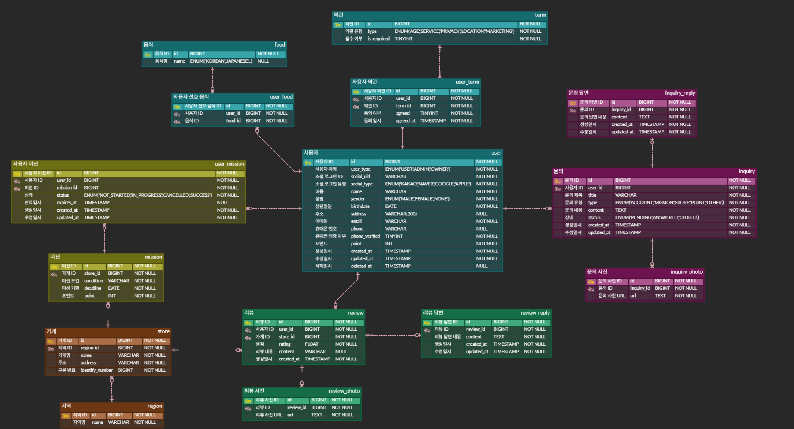

### 0. 설계한 DB 사진



---

### 1. 리뷰 작성하는 쿼리, * 사진의 경우는 일단 배제

- 조건 설정
    - 해당 가게 미션을 성공한 유저만 리뷰 작성 가능 → status 필드 사용

```sql
INSERT INTO review (user_id, store_id, rating, content, created_at)
SELECT :user_id, :store_id, :rating, :content, NOW()
WHERE EXISTS (
  SELECT 1
  FROM user_mission um
  JOIN mission m ON m.id = um.mission_id
  WHERE um.user_id = :user_id
    AND um.status  = 'SUCCESS'
    AND m.store_id = :store_id
);
```

---

### 2. 마이 페이지 화면 쿼리

- 요구사항 정리
    - 이름, 이메일, 휴대폰 번호, 인증여부, 내 포인트 조회 필요
    - 프로필 사진 DB 미설계 (ㅠㅠ)

```sql
SELECT
  u.name,
  u.email,
  u.phone,
  u.phone_verified,
  u.point,
FROM user u
WHERE u.id = :user_id;
```

---

### 3. 내가 진행중, 진행 완료한 미션 모아서 보는 쿼리(페이징 포함)

- 요구사항 정리
    - 한 페이지 당 3개씩 보이게 → limit, offset 설정
    - 미션 포인트, 가게 이름, 미션 조건, 리뷰 작성 완료 여부 조회 필요

```sql
SELECT
  um.id                         AS user_mission_id,
  um.status,
  m.point                       AS mission_point,
  s.name                        AS store_name,
  m.`condition`                 AS mission_condition, -- 예약어 방지
  EXISTS (
    SELECT 1
    FROM review r
    WHERE r.user_id = um.user_id
      AND r.store_id = s.id
  )                             AS review_written
FROM user_mission um
JOIN mission m ON m.id = um.mission_id
JOIN store   s ON s.id = m.store_id
WHERE um.user_id = :user_id
  AND um.status IN ('IN_PROGRESS','SUCCESS')
ORDER BY FIELD(um.status,'IN_PROGRESS','SUCCESS'), um.updated_at DESC -- 진행중 먼저
LIMIT 3 OFFSET 3 * (:page - 1);
```

---

### 4. 홈 화면 쿼리 (현재 선택 된 지역에서 도전이 가능한 미션 목록, 페이징 포함)

1. 지역 선택 정보
    - 지역이름, 해당 지역에서 완료한 미션 개수 (→ 10개 모을 때마다 1000포인트 지급 계산 필요)
2. 선택된 지역에서 도전 가능 미션 목록
    - 페이지당 두 개
    - 미션 포인트, 미션 조건, 가게 이름, 가게 유형(미구현 ㅠㅠ), 미션 만료 일시(미션 기한 바탕으로 계산?)

```sql
-- 지역 선택 정보
SELECT
  r.name                            AS region_name,
  COALESCE(c.completed_cnt, 0)      AS completed_in_region,
  FLOOR(COALESCE(c.completed_cnt,0) / 10) * 1000 AS earned_points
FROM region r
LEFT JOIN (
  SELECT s.region_id, COUNT(*) AS completed_cnt
  FROM user_mission um
  JOIN mission m ON m.id = um.mission_id
  JOIN store  s ON s.id = m.store_id
  WHERE um.user_id = :user_id
    AND um.status  = 'SUCCESS'
  GROUP BY s.region_id
) c ON c.region_id = r.id
WHERE r.id = :region_id;

-- 도전 가능 미션 목록
SELECT
  m.id                  AS mission_id,
  m.point               AS mission_point,
  m.`condition`         AS mission_condition,
  s.name                AS store_name,
  NULL                  AS store_category,               -- 미구현
  m.deadline            AS expected_expire_at
FROM mission m
JOIN store s
  ON s.id = m.store_id
LEFT JOIN user_mission um
  ON um.mission_id = m.id
 AND um.user_id    = :user_id
 AND um.status IN ('IN_PROGRESS','SUCCESS')
WHERE s.region_id = :region_id
  AND um.id IS NULL
ORDER BY m.deadline ASC, m.id DESC
LIMIT 2 OFFSET 2 * (:page - 1);
```