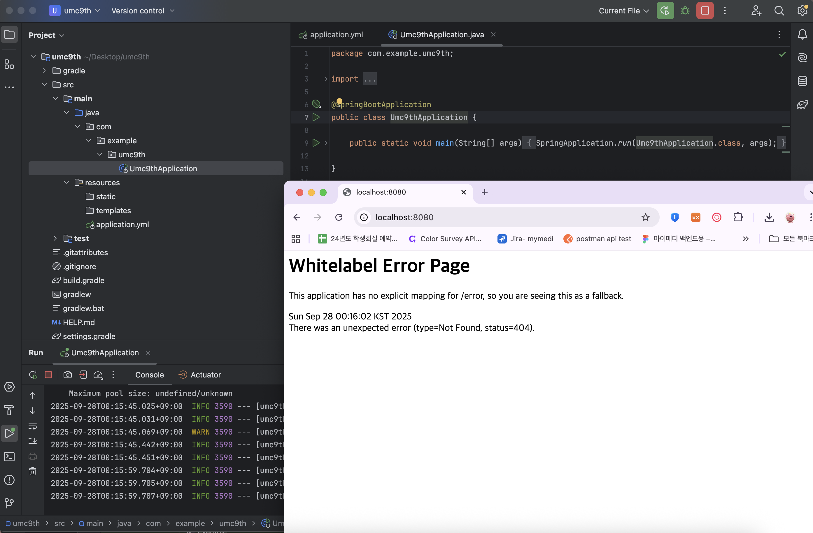

# Path Variable과 query String의 차이

  **Path Variable**

  → **고유한 리소스 식별자** (ID, 코드 같은 것)

  → 계층적인 구조를 표현할 때 사용

    ```java
    GET /stores/45/menu → id=45인 가게의 메뉴
    ```

  **query String**

  → 리소스 컬렉션에 조건을 주거나 필터링할 때 사용

  → 정렬, 페이징, 검색조건 등은 Query String이 적합

    ```java
    GET /users?role=admin&page=2
    GET /stores?location=안암동
    ```

# API 명세서

| API 이름                 | API Endpoint                                   | Request Body                                                                                                                                       | Request Header                        | Query String                                                            | Path Variable  |
| ---------------------- | ---------------------------------------------- | -------------------------------------------------------------------------------------------------------------------------------------------------- | ------------------------------------- | ----------------------------------------------------------------------- | -------------- |
| 홈 화면                   | `GET /home`                                    | 없음 (GET 요청)                                                                                                                                        | `Authorization: accessToken (String)` | `GET /home?location=안암동` <br> → 피그마에 지역 선택 기능 존재 (한 유저가 여러 개의 지역 등록 가능) | 없음             |
| 마이 페이지 리뷰 작성           | `POST /users/reviews`                          | `json<br>{<br> "store_id": {현재 리뷰 쓰는 store_id},<br> "body": "맛있었어요!",<br> "score": 5,<br> "images": {이미지 url}<br>}`                                | `Authorization: accessToken (String)` | 없음                                                                      | 없음             |
| 미션 목록 조회 (진행중, 진행 완료)  | `GET /missions`                                | 없음 (GET 요청)                                                                                                                                        | `Authorization: accessToken (String)` | `GET /missions?status="진행중"`                                            | 없음             |
| 미션 성공 누르기              | `POST /missions/{mission_id}/complete-request` | 없음 (mission만 불러와도 됨)                                                                                                                               | `Authorization: accessToken (String)` | 없음                                                                      | `{mission_id}` |
| 회원 가입 하기 (소셜 로그인 고려 X) | `POST /users/signup`                           | `json<br>{<br> "name": {사용자 이름},<br> "gender": {사용자 성별},<br> "age": {사용자 나이},<br> "address": {사용자 주소},<br> "preferences": [선호 음식 카테고리 ID 목록]<br>}` | 없음 (회원가입 시 accessToken 불필요)           | 없음                                                                      | 없음             |

# 시니어 미션 블로그 링크
https://velog.io/@seonseon/UMC3%EC%A3%BC%EC%B0%A8-%EA%B3%BC%EC%A0%9C

# 실습 인증 사진
