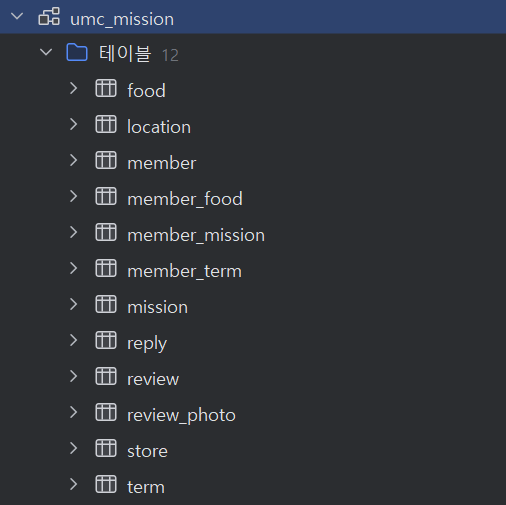

# WEEK 4 - 💧나미/이나영
## 미션 수행한 깃허브 리포지토리 링크
https://github.com/na311ng/umc9th
## ERD 사진

## DB 사진
[구조]

[member DDL]

    create table member
    (
        id             bigint auto_increment
            primary key,
        name           varchar(15)                                not null,
        gender         enum ('MALE', 'FEMALE', 'NONE')            not null,
        birthday       date                                       not null,
        address        varchar(255)                               not null,
        detail_address varchar(255)                               null,
        email          varchar(255)                               null,
        phone_num      varchar(11)                                null,
        social_uid     varchar(255)                               null,
        point          int default 0                              not null,
        updated_at     datetime                                   not null,
        created_at     datetime                                   not null,
        deleted_at     datetime                                   null,
        social_type    enum ('KAKAO', 'NAVER', 'APPLE', 'GOOGLE') null
    );

[food DDL]
    
    create table food
    (
        id   bigint auto_increment
            primary key,
        name varchar(255) not null
    );

[member_food DDL]

    create table member_food
    (
        id        bigint auto_increment
            primary key,
        member_id bigint null,
        food_id   bigint null,
        constraint FK_MEMBER_FOOD_ON_FOOD
        foreign key (food_id) references food (id),
        constraint FK_MEMBER_FOOD_ON_MEMBER
            foreign key (member_id) references member (id)
    );    

[term DDL]
    
    create table term
    (
        id   bigint auto_increment
            primary key,
        name varchar(255) not null
    );

[member_term DDL]
    
    create table member_term
    (
        id        bigint auto_increment
            primary key,
        member_id bigint null,
        term_id   bigint null,
        constraint FK_MEMBER_TERM_ON_MEMBER
            foreign key (member_id) references member (id),
        constraint FK_MEMBER_TERM_ON_TERM
            foreign key (term_id) references term (id)
    );

[mission DDL]
    
    create table mission
    (
        id          bigint auto_increment
            primary key,
        created_at  datetime     not null,
        duration    date         not null,
        conditional varchar(255) not null,
        point       int          not null,
        store_id    bigint       not null,
        constraint FK_MISSION_ON_STORE
            foreign key (store_id) references store (id)
    );

[member_mission]
    
    create table member_mission
    (
        id          bigint auto_increment
            primary key,
        is_complete bit    not null,
        member_id   bigint not null,
        mission_id  bigint not null,
        constraint FK_MEMBER_MISSION_ON_MEMBER
            foreign key (member_id) references member (id),
        constraint FK_MEMBER_MISSION_ON_MISSION
            foreign key (mission_id) references mission (id)
    );

[store DDL]
    
    create table store
    (
        id          bigint auto_increment
            primary key,
        address     varchar(255) not null,
        boss_number varchar(20)  not null,
        location_id bigint       not null,
        name        varchar(50)  not null,
        constraint FK_STORE_ON_LOCATION
            foreign key (location_id) references location (id)
    );

[location DDL]
    
    create table location
    (
        id   bigint auto_increment
            primary key,
        name varchar(255) not null
    );

[review DDL]
    
    create table review
    (
        id         bigint auto_increment
            primary key,
        created_at datetime not null,
        content    text     not null,
        star       float    not null,
        member_id  bigint   not null,
        store_id   bigint   not null,
        constraint FK_REVIEW_ON_MEMBER
            foreign key (member_id) references member (id),
        constraint FK_REVIEW_ON_STORE
            foreign key (store_id) references store (id)
    );

[review_photo DDL]
    
    create table review_photo
    (
        id        bigint auto_increment
            primary key,
        review_id bigint       not null,
        photo_url varchar(255) not null,
        constraint FK_REVIEW_PHOTO_ON_REVIEW
            foreign key (review_id) references review (id)
    );

[reply DDL]
    
    create table reply
    (
        id         bigint auto_increment
            primary key,
        content    text     not null,
        review_id  bigint   not null,
        created_at datetime not null,
        constraint uc_reply_review
        unique (review_id),
        constraint FK_REPLY_ON_REVIEW
            foreign key (review_id) references review (id)
    );

## 생성 브랜치 설명
### Feat/Chapter4 Commit 936025c
    member 엔티티 및 관련 Enum, BaseEntity 생성 후 매핑 완료
    
    트러블 슈팅 : Member에 gender type을 enum으로 지정해줬는데도 datagrip의 gender type이 안바뀜
    원인 : datagrip에 저번 실습 중에 임의로 넣은 더미 데이터 때문에 string -> enum으로 바꿀 수 없었음
    해결 방안 : 더미 데이터 삭제 후 수정할 수 있었다.
    
[수정 전]

    create table member
    (
        id             bigint auto_increment
            primary key,
        name           varchar(15)                     not null,
        gender         enum ('MALE', 'FEMALE', 'NONE') not null,
        birthday       date                            not null,
        address        varchar(255)                    not null,
        detail_address varchar(255)                    null,
        email          varchar(255)                    null,
        phone_num      varchar(20)                     null,
        social_uid     varchar(255)                    null,
        social_type    enum ('KAKAO', 'NAVER', 'APPLE', 'GOOGLE') null,
        point          int     default 0               null,
        deleted_at     datetime                        null,
        updated_at     datetime default CURRENT_TIMESTAMP null on update CURRENT_TIMESTAMP
    
    );
---
    *점검 사항
    필드 | 수정 | 근거
    name | varchar(15) | 이름이 3자 이상일 수 있기 때문에 15자로 변경
    detailAddress | nullable = true | 상세 주소 입력 안하는 사용자 고려
    email, phoneNum,socialUid, socialType | nullable = true | 추후 추가 및 일반 회원가입 시 고려 하지 않음
    point | nullable = false, Default 값 0 으로 지정 | 회원가입 시 기본 포인트 0 으로 지정
    deletedAt | nullable = true | 회원 탈퇴 시에만 값이 생기기 때문에 false말고 true로

[수정 후]

    create table member
    (
        id             bigint auto_increment
            primary key,
        name           varchar(15)                     not null,
        gender         enum ('MALE', 'FEMALE', 'NONE') not null,
        birthday       date                            not null,
        address        varchar(255)                    not null,
        detail_address varchar(255)                    null,
        email          varchar(255)                    null,
        phone_num      varchar(255)                    null,
        social_uid     varchar(255)                    null,
        point          int                             not null,
        updated_at     datetime                        not null,
        created_at     datetime                        not null,
        deleted_at     datetime                        null,
        social_type    varchar(255)                    null
    );
### feat/mission-entity Commit 2f39ad4
    mission 엔티티 생성 후 매핑 완료
[생성된 DDL]

    create table mission
    (
        id          bigint auto_increment
            primary key,
        created_at  datetime     not null,
        updated_at  datetime     not null,
        duration    date         not null,
        conditional varchar(255) not null,
        point       int          not null,
        store_id    bigint       not null,
        constraint FK_MISSION_ON_STORE
            foreign key (store_id) references store (id)
    );
---
    트러블슈팅 : Member entity에서 쓴 BaseEntity를 쓰니까 erd에 없던 updated_at 컬럼이 생기는 문제 발생
    해결 방안 : BaseEntity를 분리하기로 결정

### refactor/base-entity-structure Commit de16a0b
    BaseEntity 분리
    
    BaseEntity를 BaseCreatedEntity(created_at), BaseTimeEntity(updated_at)으로 분리함
    분리한 이유 : 1. 의존성 최소화 (SRP-단일 책임 원칙)
                2. DB 스키마 명확성 유지 : 정적 데이터와 동적 데이터 구분이 쉬워짐
                3. 유지보수 / 확장성 면에서 이점 
---
    com.example.umc9th
    ┣ 📂 domain
    ┃ ┣ 📂 member
    ┃ ┣ 📂 mission
    ┃ ┣ 📂 review
    ┃ ┗ 📂 store
    ┗ 📂 global
        ┗ 📂 entity
            ┣ 📄 BaseCreatedEntity.java
            ┣ 📄 BaseTimeEntity.java
        ┗ 📄 Umc9thApplication.java

### feat/store-entity Commit 4f11add
    store/location 엔티티 생성 후 매핑 완료

    store 엔티티에 createdAt 및 updatedAt을 넣지 않은 이유는
    주어진 미션에서 store가 정적 데이터(위치 + 이름)라고 판단했기 때문

### feat/review-entity Commit 3565b7d
    review/review_photo/reply 엔티티 생성 후 매핑 완료

    리뷰 엔티티에 updated_at 나 deleted_at 이 없는 이유는 따로 수정/삭제 버튼이 없기 때문
    리플라이 엔티티에는 생성일자가 있어서 created_at 추가해줌 
    또, 리뷰-리플라이 관계는 리뷰 하나에 점포 답글 하나가 달리기 때문에 1:1로 매핑
    리뷰-리뷰포토 의 경우, 리뷰가 삭제되면 리뷰포토도 삭제되기 때문에 양방향 매핑 설정해줌

### fix/nullable Commit d563a63
    fix: term, food nullable false로 변경
    Member의 deletedAt 타입 LocalDateTime으로 변경

### fix/member-default-values Commit d9e1720

    DDL에 EnumType이랑 defalut 값이 표기가 안되어 있어 columnDefinition으로 보이도록 수정 

[수정 후]

    create table member
    (
        id             bigint auto_increment
            primary key,
        name           varchar(15)                                not null,
        gender         enum ('MALE', 'FEMALE', 'NONE')            not null,
        birthday       date                                       not null,
        address        varchar(255)                               not null,
        detail_address varchar(255)                               null,
        email          varchar(255)                               null,
        phone_num      varchar(11)                                null,
        social_uid     varchar(255)                               null,
        point          int default 0                              not null,
        updated_at     datetime                                   not null,
        created_at     datetime                                   not null,
        deleted_at     datetime                                   null,
        social_type    enum ('KAKAO', 'NAVER', 'APPLE', 'GOOGLE') null
    );

