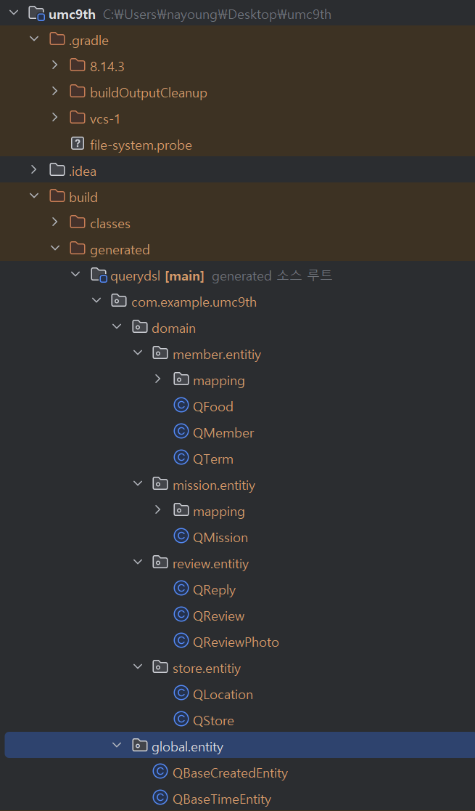

# WEEK 6 - 💧나미/이나영
## 1. QueryDSL 설치 과정 인증하기
build.gradle에 코드 삽입 후, 동기화 + 프로젝트 실행 후 설치된 모습

## 2. 내가 작성한 리뷰보기 API, QueryDSL로 구현하기
    필터링 조건 : 가게별, 별점별
    제약 조건 : 하나의 API로 설계

### 레포 링크
https://github.com/na311ng/umc9th/tree/feat/Chapter6