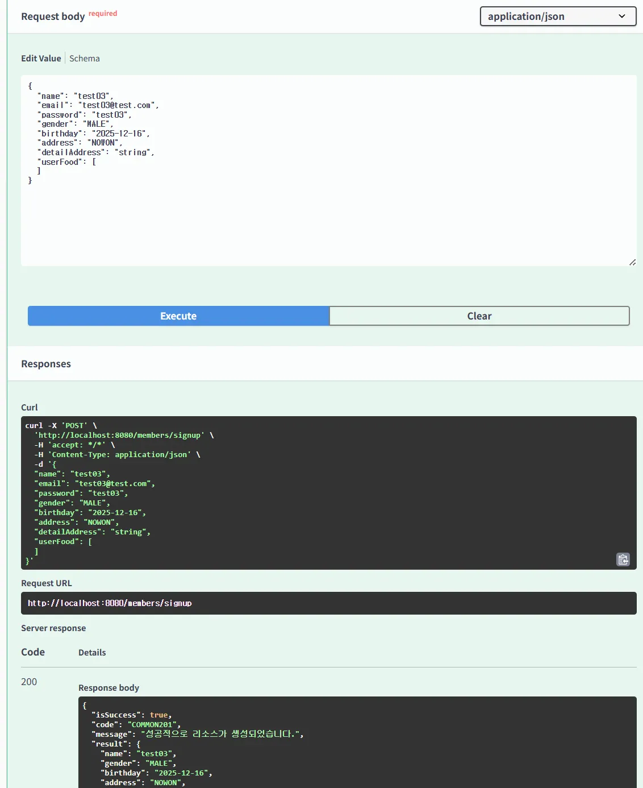
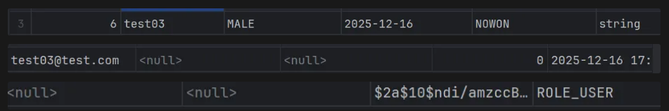
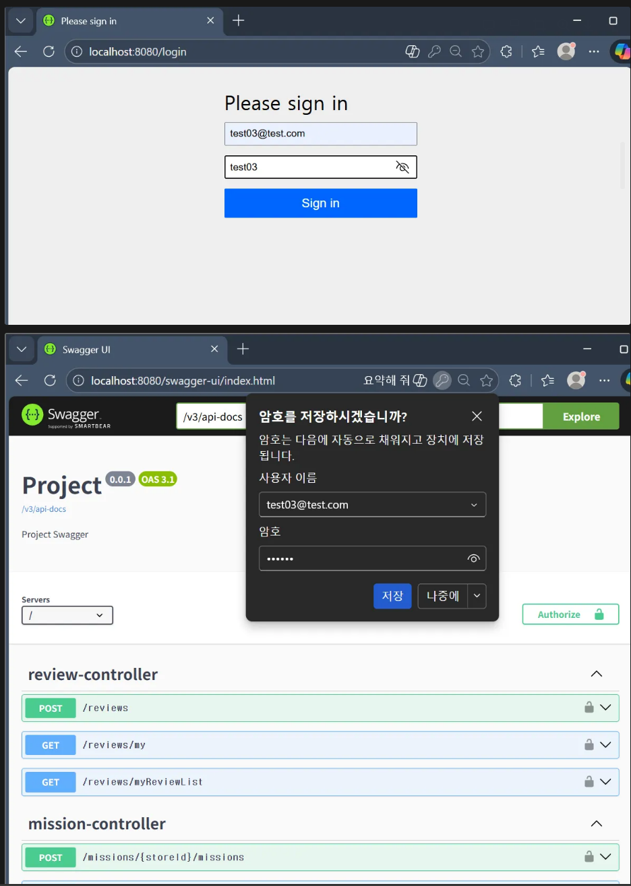
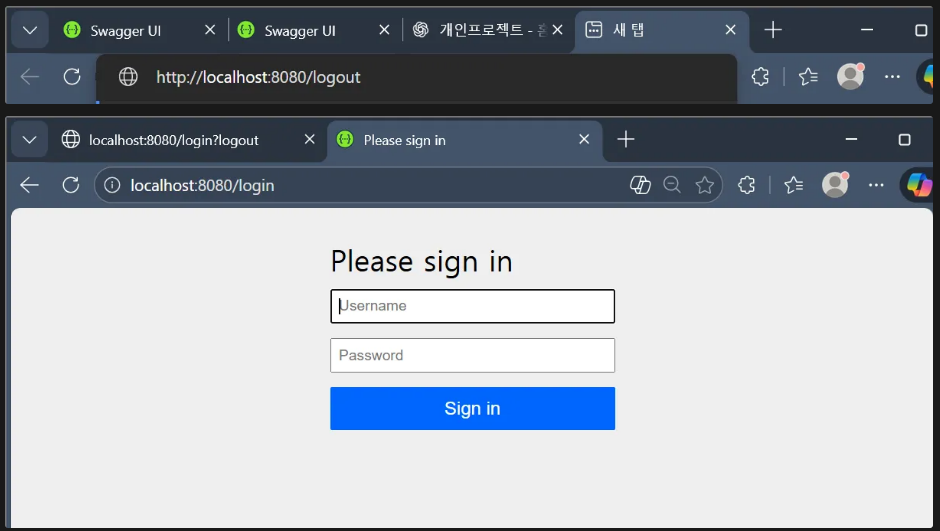
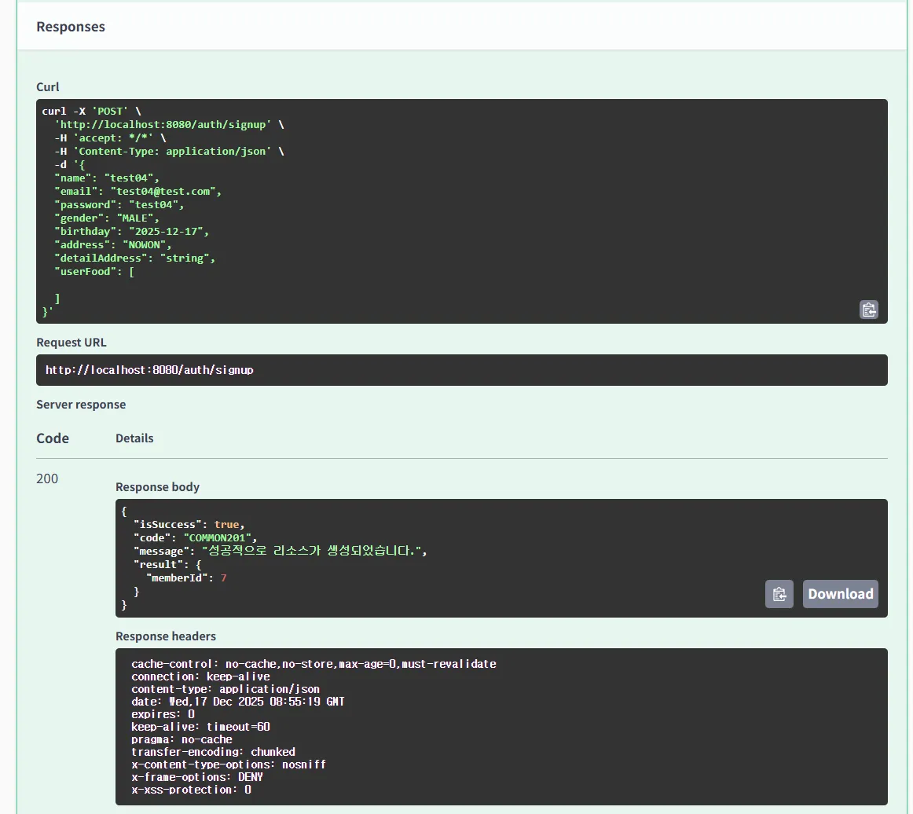
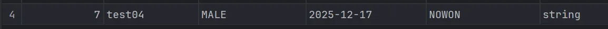
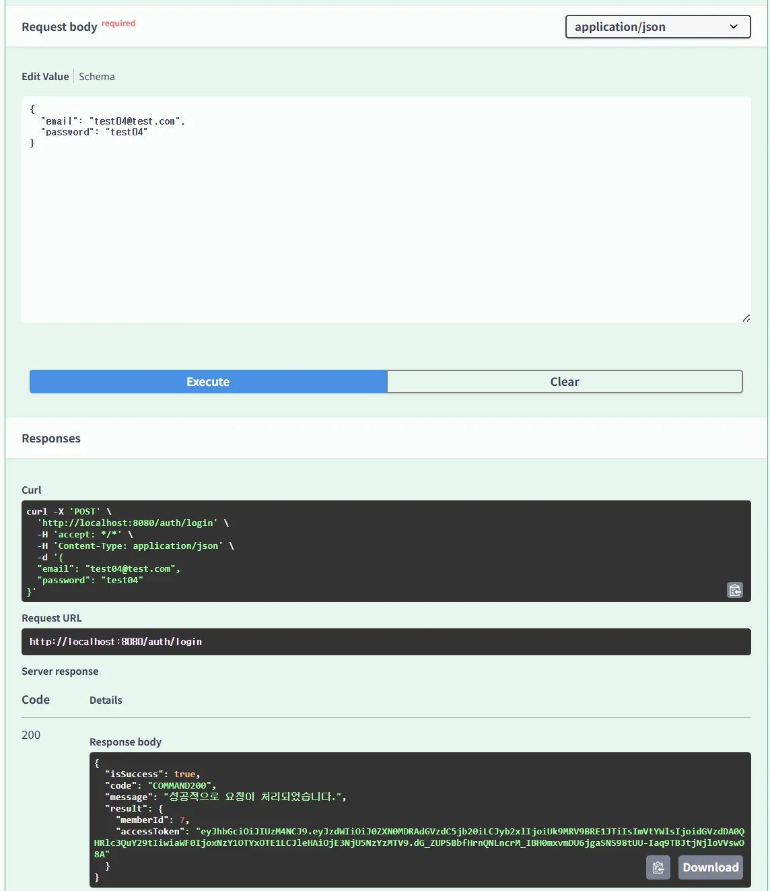
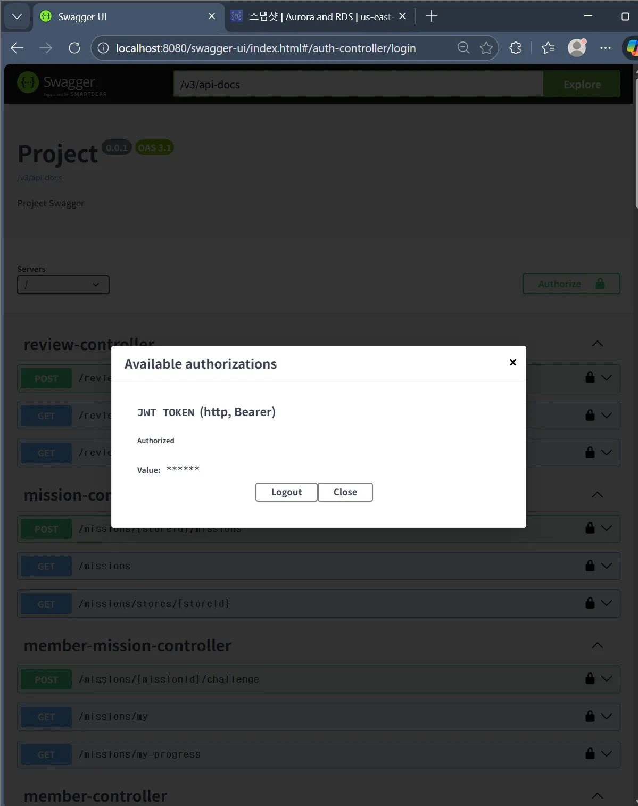
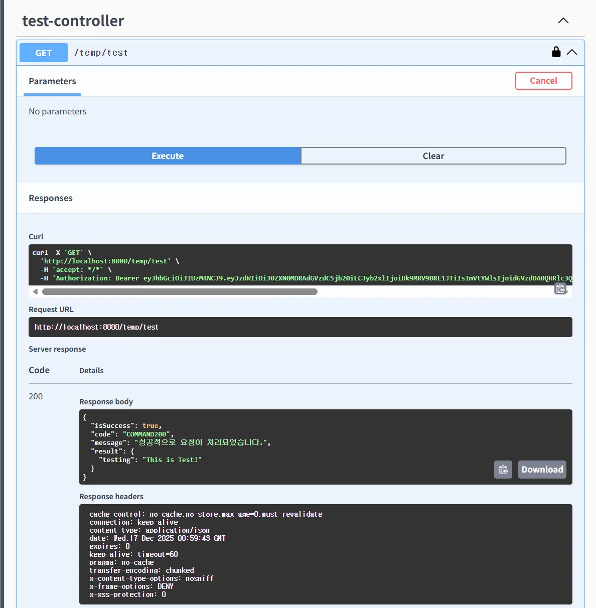

# WEEK 10 - 💧나미/이나영

## session 방식 
### 회원가입

DB에 생성된 모습

### 로그인
ROLE_ADMIN으로 변경 후 로그인하니, 스웨거로 리다이렉트 된 모습

### 로그아웃
주소에 logout 후 스웨거로 돌아가면 로그아웃 된 모습

### 깃허브 브랜치 주소
https://github.com/na311ng/umc9th-na311ng/tree/feat/SpringSecurity

## token 방식
### 회원가입

### 로그인

token access 후 test 해보면 성공하는 모습

### 깃허브 브랜치 주소 
https://github.com/na311ng/umc9th-na311ng/tree/feat/JWT
